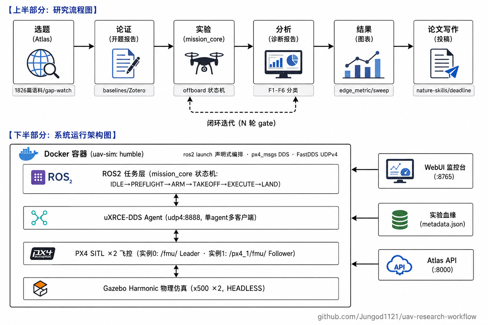

# UAV Research Workflow — 半自动科研助手

**Semi-automated research pipeline for UAV navigation research**: 选题 → 论证 → 实验 ⇄ 分析 → 结果产出 → 论文写作。从「研究空白」到「可写进论文的结果」全链路带血缘、可复现、可监控。

> **主体是现有 agent harness（Claude Code / opencode），不是新建科研 agent**。能力以声明式资产存在：SKILL.md（方法论）+ MCP servers（感知/行动）+ bash 脚本（原子工具）。换 harness 或升级模型，资产原样可用。

## 架构总览



## 验证里程碑（原生与容器内同口径）

| 里程碑 | 指标 | 验收标准 | 状态 |
|---|---|---|---|
| HOLD 位置保持 | 漂移 **0.068 m** | ≤ 0.10 m | ✅ |
| SQUARE 四分点导航 | 外飘 **0.104 m**（13/13 航点） | < 0.15 m（位置阶跃需插密航点拽直弧线） | ✅ |
| A1 双机 bring-up | `/fmu/` + `/px4_1/fmu/` 双通道 ~100 Hz，漂移 0.068 / 0.105 m | namespace 隔离 + 双 ACK 确认 | ✅ |
| A2 编队飞行 | Leader 13/13 · Follower 10101 样本（均值 0.55 m，东向 2 m） | Follower 相对位置保持 | ✅ |
| Docker 复现 | `uav-sim:humble`（11.4 GB）容器内任务逐米级对齐原生 | 他人一条 `docker run` 可复现 | ✅ |
| 监控台 | `http://localhost:8765` 聚合构建/仿真/实验/系统 | 自启动、无需守终端 | ✅ |

## 快速开始

### 1) 监控台（先看全局状态）

```bash
# 已注册为 systemd 用户服务，开机自启
systemctl --user status uav-monitor.service
# 浏览器打开 http://localhost:8765
# Docker Build / Sim Stack(PX4/GZ/Agent + 一键起停) / Experiments 血缘表 / System / 日志流(四 Tab)
```

### 2) 原生仿真栈（日常开发）

```bash
./scripts/sim_launch.sh        # 幂等启动 + READY 数据流探测（GUI 自动 GL 兜底）
./scripts/sim_stop.sh          # 干净关停（进程清理验证）
# 双机: STACK_INSTANCES=2 ./scripts/sim_launch.sh
```

### 3) Docker 可复现层（给他人/课程/投稿环境）

```bash
# 宿主机 Docker 代理需指向 Clash(7897)，见 docs/WORKFLOW.md §Docker
sg docker -c "docker run -d --name uav-sim --network host --shm-size 2gb \
  -e ROS_DOMAIN_ID=77 -e STACK_INSTANCES=1 uav-sim:humble"   # 双机用 =2
# 容器内验证与任务
sg docker -c "docker exec uav-sim bash -c 'source /opt/ros/humble/setup.bash && source /root/px4_ros2_ws/install/setup.bash && timeout 8 ros2 topic hz /fmu/out/sensor_combined'"
sg docker -c "docker exec uav-sim bash -c 'source /opt/ros/humble/setup.bash && source /root/px4_ros2_ws/install/setup.bash && timeout 150 python3 scripts/run_mission_v2.py hold /tmp/h.json'"
```

> 重建镜像：`docker build --network host --build-arg HTTP_PROXY=http://127.0.0.1:7897 --build-arg HTTPS_PROXY=http://127.0.0.1:7897 -t uav-sim:humble -f docker/Dockerfile .`（PX4 编译约 30-45 分钟，本地生成构建产物见 `docker/README` 注释与 `.gitignore`）

### 4) 对 agent 说（skill 触发语）

| 你说 | 触发 | 产出 |
|---|---|---|
| 「跑一次 hold / 方框实验」 | run-experiment | `experiments/<id>/`：metadata.json 血缘 + metrics + bag |
| 「分析这次结果」 | analyze-results | diagnosis_report.md（数据+视觉双通道，F1–F6 分类） |
| 「继续迭代，最多 5 轮」 | iterate-experiment | 收敛表 + 最优配置（每轮带 PARENT_EXP 血缘） |
| 「扫参 speed×tol 网格」 | run-sweep | summary.csv/md + traj_compare.png（论文级聚合） |
| 「VLA × GPS-denied 有变化吗」 | gap-watch | watchlist 格子 diff 提醒（需 Atlas :8000） |
| 「把这个格子转成开题报告」 | gap-to-proposal | proposal.md + baselines.md + refs.bib |
| 「标注 part_03」 | paper-annotation | 金标结果 JSON（Atlas 校准用） |
| 「投稿截止日」 | deadline_watch | ICS + Markdown 表（ICRA 9 月中截稿） |

## 技术要点

- **编排**：`ros2 launch launch/sim_stack.launch.py` 声明式编排（替代 bash 手搓）；PX4 SITL 自管 gz server 生命周期（rcS 内建）；`launch` 支持 `STACK_INSTANCES=2`（官方 `-i`/`MAV_SYS_ID`/`px4_N` 命名空间约定，单 agent 多客户端）
- **任务状态机**：`scripts/mission_core.py` 遵守官方 offboard 契约——`OffboardControlMode` 心跳 >2Hz、切模式前预流 ≥1s、**ARM/模式切换 ACK 重试确认制**；`namespace`+`mav_sys_id` 参数化对齐多机（`target_system` 必须匹配 `MAV_SYS_ID`，否则命令被静默忽略）
- **无头参数三件套**：`px4-rc.params`（`COM_RC_IN_MODE=4` · `COM_RCL_EXCEPT=4` · `NAV_DLL_ACT=0`），持久化优于改机架文件
- **可靠网络**：`GZ_IP=127.0.0.1`（组播 rt_offload 不稳）、`FASTDDS_BUILTIN_TRANSPORTS=UDPv4`（禁 SHM 残段）、`ROS_DOMAIN_ID=77`；构建用 git HTTP/1.1（代理 HTTP2 framing 断流）
- **实验血缘**：每次实验自动写 `experiments/<id>/metadata.json`（`proposal_id`/`gap_cell_id`/`hypothesis`/`parent_experiment_id`/`resolved_config`/`cfg_hash`/git 版本），`exp_index.py` 重建关系表，历史可归因
- **监控台**：FastAPI(`webui/backend.py`) 聚合 systemctl/tail/docker/ros2 hz/psutil + Apple 风格前端（Tailwind CDN、bento、玻璃拟态、深色终端）

## 环境基线（已钉版）

| 组件 | 版本 | 备注 |
|---|---|---|
| Ubuntu / ROS 2 | 22.04 / Humble | 原生（Python 3.10） |
| Gazebo / PX4 | Harmonic 8.15 / **v1.16.0** | server 恒 HEADLESS；px4_msgs 钉 `release/1.16` |
| uXRCE-DDS Agent | 静态链接本地构建 | `~/Micro-XRCE-DDS-Agent/build/` |
| MCP: mcp-rosbags | rosbags==0.9.23 + mcp==1.12.4 | 15 tools，bag 离线分析 |
| MCP: ros-mcp | mcp==1.9.4（Humble CI） | 24 tools，实时 ROS 控制 |
| Docker | 29.1.3 | 镜像 `uav-sim:humble`，代理 7897 |

⚠️ 升级任何依赖前先跑冒烟测试；已知坑清单（NVIDIA GLX、lockstep、QoS、v1.16 版本化话题名等 20+ 条）在 `skills/experiment-setup/SKILL.md`。

## 仓库结构

```
├── skills/        8 个自建技能（symlink → ~/.claude/skills/）
├── scripts/       原子工具: sim_launch/stop · run_mission_v2 · mission_core/follower
│                  edge_metric · obs_pack · sweep_runner/aggregate · gap_watch
│                  deadline_watch · smoke_test · exp_metadata/index (+ systemd 模板)
├── launch/        sim_stack.launch.py（声明式编排，STACK_INSTANCES 双机）
├── docker/        Dockerfile(8 项构建坑修复) + compose + 本地生成产物说明(.gitignore)
├── webui/         FastAPI 后端 + Apple 风格前端（:8765，uav-monitor.service）
├── assets/        architecture.svg（本 README 架构图）
├── templates/     experiment_log · diagnosis_report · repro_checklist · sweep_spec
├── config/        gap_watchlist.yaml
├── experiments/   每次实验目录（血缘+metrics+diagnosis+obs_pack），git 忽略大文件
├── proposals/     开题产物（gap-to-proposal）
├── vendor/        外部 skills 安装区（nature-skills×8，仅文档化）
└── docs/WORKFLOW.md  详细手册（MCP 钉版 · Zotero 桥 · 七层视图 × 坑清单对照）
```

## 待启用（一次性）

```bash
systemctl --user enable --now uav-gap-watch.timer   # 每日 08:30 空白格子追踪
systemctl --user enable --now uav-smoke.timer       # 每周一 09:00 环境哨兵
python3 scripts/gap_watch.py --init                  # 建基线快照
```

## 路线图（触发条件驱动，勿提前）

- **results-to-paper 聚合 skill**：第一批论文级数据就位后，从多实验（尤其 sweep summary）直接出论文图表（metadata.json 即契约）
- **W&B 接入**：RL/训练类实验启动时（rosbag 不承载训练曲线）
- **真机桥接**：mavros2（MAVLink 层）/ pyrealsense2（RealSense）

## 诚实边界

- 「连续 N 轮」等 gate 是会话约定（SKILL.md），非进程级硬保证
- gap-watch 只报变化，判断在人；「稀疏 ≠ 机会」贯穿 Atlas 口径
- AI 不代替选题决策与方法设想（proposal 方法章留白给作者）
- 全流程依赖语义/版本钉死——升级前必跑 smoke_test

## 相关仓库

- **UAV Research Atlas**（选题层）：`github.com/Jungod1121/uav-research-atlas`（private）——1,826 篇语料、四轴 taxonomy、gap 检测与解释；本工作流通过其 HTTP API 只读调用
- 实验产物即本仓库 `experiments/`（备份：`scripts/backup.sh`，restic 分级）
