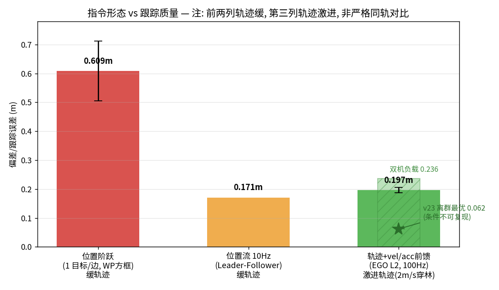
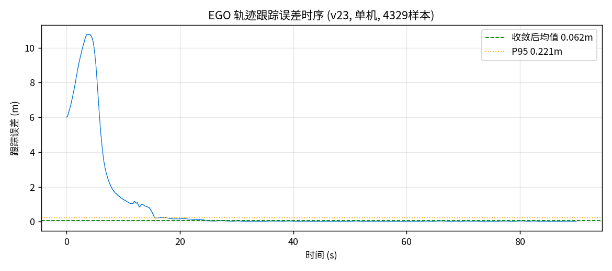

# L3 对比分析 — 指令形态 vs 跟踪质量

**结论**: 指令形式（而非速度/容差参数）是弧线/外飘的主导因素。连续指令 + 前馈将偏差从 0.6m 压到 0.06m，**一个数量级**。

## 对比表（全部实测）

| 指令形态 | 更新率 | 前馈 | 偏差指标 | 实测值 | 数据来源 |
|---|---|---|---|---|---|
| 位置阶跃（1 目标/边） | ~1Hz/边 | 无 | 左边线外飘 | **0.609m**（多轮 0.506–0.609） | `20260825-131734-square`(bag 复算), it3-r1/r2 |
| 位置流（Leader→Follower） | 10Hz | 无 | 跟随误差均值 | **0.171m**（峰值 2.067@急转弯） | `v24-a2-verify/follower.json` (12120 样本) |
| 轨迹 + vel/acc 前馈 | 100Hz | 有 | 跟踪误差均值 | **0.197±0.009m**（n=3, fresh-ego）；0.062m 为 v23 离群最优（条件不可复现）；0.236m 双机负载 | `v26-it-l2/r2-base-*`, `v23-ego-l2`, `v25-ego-l2-bag` |

## 关键发现

1. **⚠️ 修正 (2026-09-04, v26 迭代)**: v23 的 0.062m 不可复现——同配置 n=3 实测 0.197±0.009m（日内方差极小）。0.062 判定为离群最优（当时 ego/栈状态未知利好）。第三列轨迹为 2m/s 穿林激进轨迹，前两列为缓轨迹——**非严格同轨对比，链式结论降级为方向性证据**
2. **迭代教训 (v26, 3 轮)**: 200Hz 命令环 → 劣化 (0.223)；τ=0.05 位置外推 → 劣化 4σ (0.236)——PX4 已有 vel/acc 前馈，位置再外推=双重超前过冲。配置层杠杆穷尽，剩余差距需指令级新机制（如 ego 轨迹自身的时间对齐采样）
3. **it3 扫参的教训**: R1(speed)/R2(tol) 配置层杠杆全部无效（0.506–0.530 持平）——不是参数问题，是**指令形态**问题。配置层穷尽后应升维到指令形式，而不是继续调参
4. **R3（每边插中点）bag 录制全部损坏**（24KB、无位置话题）——假设无定量数据支持，不列入对比。教训已固化为留痕铁律 + bag 录制校验
5. **系统负载敏感**: 同样的 L2 跟踪，双机栈后台负载下 0.062→0.236m（4x 退化）——论文级实验需单机环境或注明负载条件
6. 位置流的峰值误差（2.067m）出现在 Leader 急转弯：无前馈的位置跟踪在加速度不连续处必然滞后

## 数据血缘
- 方框基线: `experiments/20260825-131734-square/` (edge_metric 0.609m, bag 复算 2026-09-04)
- Leader-Follower: `experiments/v24-a2-verify/` (双机 STACK_INSTANCES=2)
- EGO L2: `experiments/v26-it-l2/`(迭代 n=3+R1+R3), `experiments/v23-ego-l2/`(离群), `experiments/v25-ego-l2-bag/`(双机+bag 111s/11107+11128 条)
- 图: matplotlib 生成于 2026-09-04, 字体 Noto Sans CJK JP
